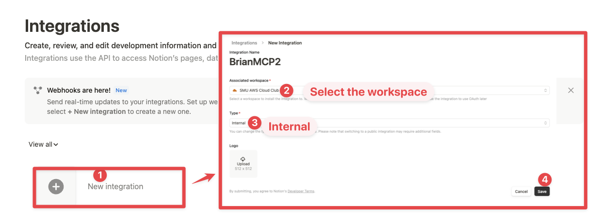
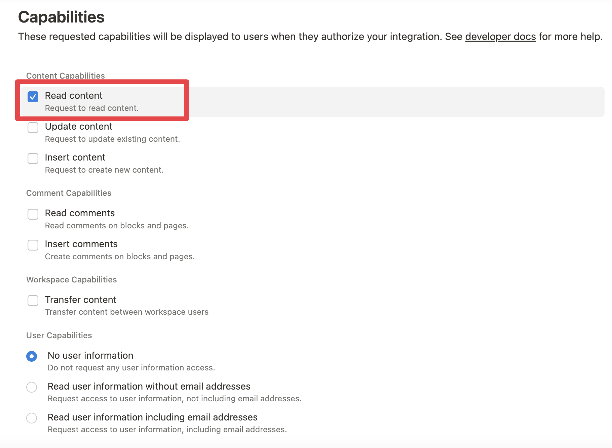
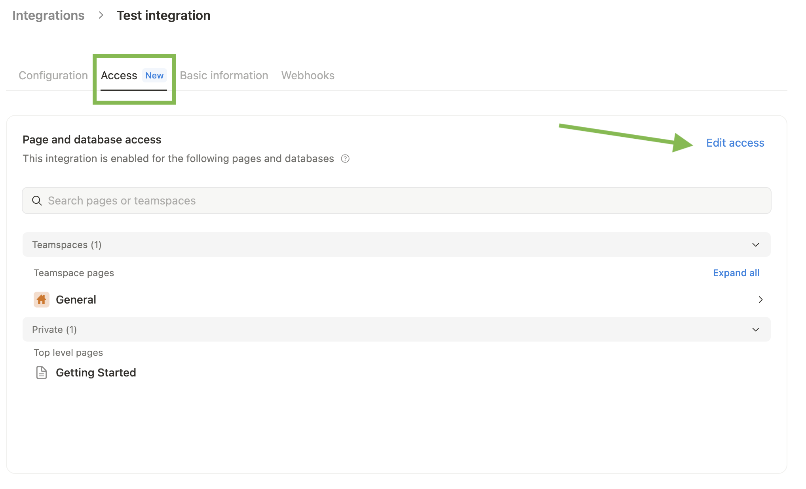
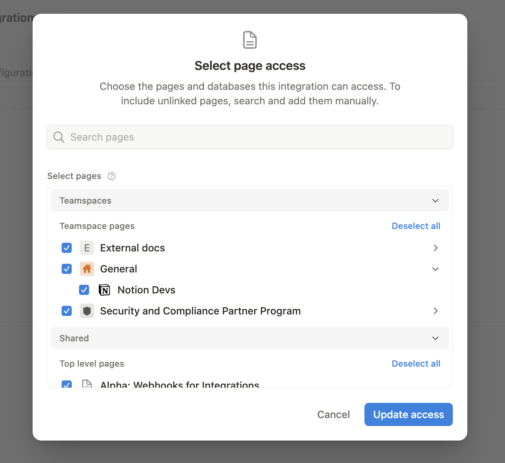

# AgentX Notion MCP Server

[](https://www.agentx.so/mcp/notion)

[](https://youtu.be/XiU9vUMgNTY)

This project implements an [MCP server](https://spec.modelcontextprotocol.io/) for the [Notion API](https://developers.notion.com/reference/intro) with **user-friendly environment variables**.


## ✨ Features

- 🔧 **User-friendly configuration** - Simple environment variables instead of complex JSON
- 🔄 **Backward compatibility** - Still supports legacy `OPENAPI_MCP_HEADERS`
- 🚀 **Easy setup** - Just set `NOTION_API_TOKEN` and optionally `NOTION_VERSION`
- 📚 **Full Notion API support** - All Notion API endpoints available
- 🛡️ **Secure** - Proper authentication and error handling

### Installation

#### 1. Setting up Integration in Notion:

Go to [https://www.notion.so/profile/integrations](https://www.notion.so/profile/integrations) and create a new **internal** integration or select an existing one.



While we limit the scope of Notion API's exposed (for example, you will not be able to delete databases via MCP), there is a non-zero risk to workspace data by exposing it to LLMs. Security-conscious users may want to further configure the Integration's _Capabilities_.

For example, you can create a read-only integration token by giving only "Read content" access from the "Configuration" tab:



#### 2. Connecting content to integration:

Ensure relevant pages and databases are connected to your integration.

To do this, visit the **Access** tab in your internal integration settings. Edit access and select the pages you'd like to use.




Alternatively, you can grant page access individually. You'll need to visit the target page, and click on the 3 dots, and select "Connect to integration".


#### 3. Adding MCP config to your client:

##### Using npm:

Add the following to your `.cursor/mcp.json` or `claude_desktop_config.json` (MacOS: `~/Library/Application\ Support/Claude/claude_desktop_config.json`)

```javascript
{
  "mcpServers": {
    "notionApi": {
      "command": "npx",
      "args": ["-y", "@agentx-ai/notion-mcp-server"],
      "env": {
        "NOTION_API_TOKEN": "ntn_****",
        "NOTION_VERSION": "2022-06-28"
      }
    }
  }
}
```

**Note:** `NOTION_VERSION` is optional and defaults to `"2022-06-28"` if not provided.

##### Using Docker:

There are two options for running the MCP server with Docker:

###### Option 1: Using the official Docker Hub image:

Add the following to your `.cursor/mcp.json` or `claude_desktop_config.json`:

```javascript
{
  "mcpServers": {
    "notionApi": {
      "command": "docker",
      "args": [
        "run",
        "--rm",
        "-i",
        "-e", "NOTION_API_TOKEN",
        "-e", "NOTION_VERSION",
        "mcp/notion"
      ],
      "env": {
        "NOTION_API_TOKEN": "ntn_****",
        "NOTION_VERSION": "2022-06-28"
      }
    }
  }
}
```

This approach:

- Uses the official Docker Hub image
- Uses simple environment variables instead of complex JSON
- Provides a more user-friendly configuration method

###### Option 2: Building the Docker image locally:

You can also build and run the Docker image locally. First, build the Docker image:

```bash
docker-compose build
```

Then, add the following to your `.cursor/mcp.json` or `claude_desktop_config.json`:

```javascript
{
  "mcpServers": {
    "notionApi": {
      "command": "docker",
      "args": [
        "run",
        "--rm",
        "-i",
        "-e",
        "NOTION_API_TOKEN=ntn_****",
        "-e",
        "NOTION_VERSION=2022-06-28",
        "notion-mcp-server"
      ]
    }
  }
}
```

**Legacy Support:** The old `OPENAPI_MCP_HEADERS` environment variable is still supported for backward compatibility, but the new approach is recommended for better user experience.

Don't forget to replace `ntn_****` with your integration secret. Find it from your integration configuration tab:


#### Installing via Smithery

[](https://smithery.ai/server/@agentx-ai/notion-mcp-server)

To install Notion API Server for Claude Desktop automatically via [Smithery](https://smithery.ai/server/@agentx-ai/notion-mcp-server):

```bash
npx -y @smithery/cli install @agentx-ai/notion-mcp-server --client claude
```

### Examples

1. Using the following instruction

```
Comment "Hello MCP" on page "Getting started"
```

AI will correctly plan two API calls, `v1/search` and `v1/comments`, to achieve the task

2. Similarly, the following instruction will result in a new page named "Notion MCP" added to parent page "Development"

```
Add a page titled "Notion MCP" to page "Development"
```

3. You may also reference content ID directly

```
Get the content of page 1a6b35e6e67f802fa7e1d27686f017f2
```

### Development (test locally)

Build

```
npm run build
```

Install

```
npm install -g .

```

Test with modelcontextprotocol/inspector

```
npx @modelcontextprotocol/inspector notion-mcp-server
```

Click:

```
http://localhost:6274/?MCP_PROXY_AUTH_TOKEN=xxxxxxxxxx
```
